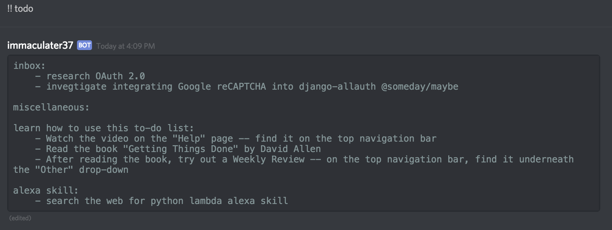

# immaculater-discord-bot
Discord bot that talks to Immaculater's django server

Immaculater is https://github.com/chandler37/immaculater

- heroku login
- heroku create <yourapp>
- heroku git:remote -a <yourapp>
- heroku config:set DISCORD_TOKEN=(see https://discordapp.com/developers/applications/me)
- Set some more envionrment variables you'll need as above.
- git push heroku master
- heroku scale worker=1
- Add your bot to your server by replacing the bot's Client ID (from the link
  above) in the link below:

https://discordapp.com/api/oauth2/authorize?client_id=ClientID&scope=bot&permissions=18432

(See https://discordapi.com/permissions.html for more on permissions.)

Select your server in the drop-down.

Speak to your new bot using '?help' and '?? help' and '?? do buy soymilk' and
'?? todo' and so forth. Use the website (see '?open') to do an initial login
with Discord (using the allauth0 branch of https://github.com/chandler37/immaculater).
